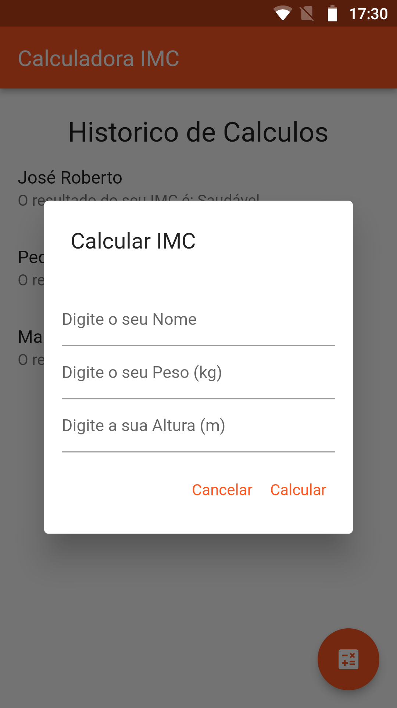
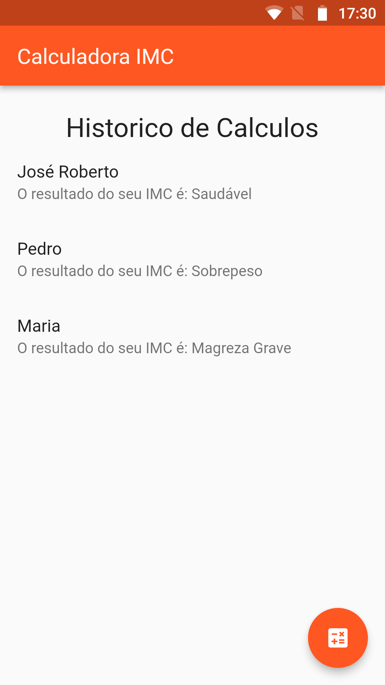

# Bootcamp Mobile com Flutter do Santander com a Dio.me 💻👨‍💻

- Repositório exclusivo para hospedar os meus desafios, aprendizados e conhecimentos adquiridos nessa intensa troca de saberes dessa incrível tecnologia que é o Flutter.

### Desafio de projeto: Aprimorando a sua Calculadora de IMC com Flutter

- O desafio se baseia em aprimorar outro desafio (Criando uma Calculadora de IMC Com Flutter) que foi feito uma calculadora para o IMC usando dart, agora era necessário criar as telas e tornar essa lógica num aplicativo.

#### Visualização:

  
  

